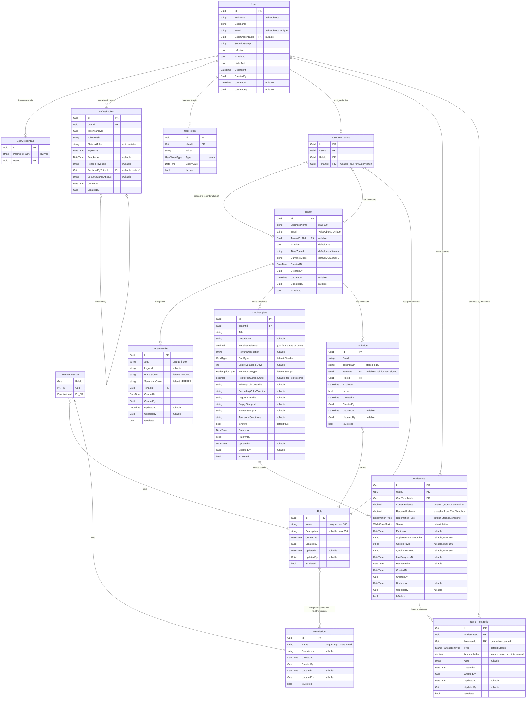

# Database Entity Relationship Diagram

> **⚠️ MAINTENANCE RULE:** This diagram MUST be updated whenever:
> - A new entity is added to `Stambat.Domain/Entities/`
> - A relationship between entities changes
> - A new FK or navigation property is added/removed
> - An entity configuration in `Infrastructure/Configurations/` is modified
>
> When updating, re-read the relevant entity files and configuration files to ensure accuracy.

## ER Diagram

## Relationship Summary

| Relationship | Type | Notes |
|---|---|---|
| User → UserCredentials | 1:0..1 | Optional, FK on UserCredentials |
| User → RefreshToken | 1:N | Cascade delete |
| User → UserToken | 1:N | Email verification, password reset tokens |
| User → UserRoleTenant | 1:N | User's role assignments per tenant |
| User → WalletPass | 1:N | Customer's loyalty passes |
| Role → UserRoleTenant | 1:N | Which users have this role |
| Role ↔ Permission | M:N | Via `RolePermission` join table (composite PK) |
| Tenant → TenantProfile | 1:0..1 | Optional profile, FK on TenantProfile |
| Tenant → UserRoleTenant | 1:N | Cascade delete |
| Tenant → CardTemplate | 1:N | Business's loyalty card templates |
| Tenant → Invitation | 1:N | Staff invitations |
| CardTemplate → WalletPass | 1:N | Passes issued from this template |
| WalletPass → StampTransaction | 1:N | Stamp history for a pass |
| StampTransaction → User (Merchant) | N:1 | The staff who performed the scan |
| Invitation → Role | N:1 | Role to assign on acceptance |
| RefreshToken → RefreshToken | 0..1:0..1 | Token rotation chain (self-referencing) |

## Key Constraints

- **UserRoleTenant:** Two filtered unique indexes:
  - `(UserId, RoleId, TenantId)` UNIQUE where `TenantId IS NOT NULL`
  - `(UserId, RoleId)` UNIQUE where `TenantId IS NULL` (super admins)
- **TenantProfile.Slug:** Unique index
- **Tenant.Email:** Unique index
- **Role.Name:** Unique index
- **User.Email:** Value object with unique constraint
- **RolePermission:** Composite PK `(RoleId, PermissionId)`
